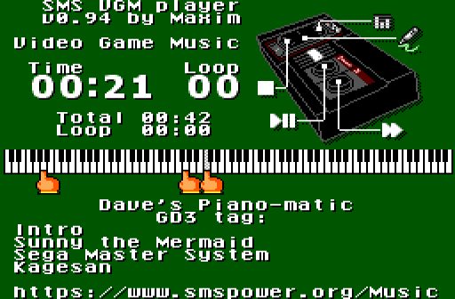

SMS VGM Player
==============

This is a "stub" which is able to play VGM files on the Sega Master System. These are logged music from video games.

It is only able to play back music composed for the sound chips it has: the Sega PSG and the YM2413 (if present). It also requires you to decompress the VGM file (if it is compressed; most are) and append it to the ROM.

If you have trouble with playback, try:

1. For compatibility with some flash cartridges, the ROM must be padded to a multiple of 64KB.
2. For compatibility with some emulators, the ROM must be be padded to a minimum of 64KB.

The included `makerom.py` Python script will do all this for you. You can invoke it by:

1. Make sure you have Python on your computer
2. Put `makerom.py`, `smsvgmplayer.stub` and some VGM files in the same directory
3. Double-click `makerom.py`

Character support
-----------------
`smsvgmplayer.stub` includes support for the Latin alphabet (with many, but not all, accented characters), as well as Hiragana and Karakana.

`smsvgmplayer-unicode.stub` includes support for over 10,000 characters including the most common Kanji and a lot of Korean. Rename it to `smsvgmplayer.stub` to use the Python script.

The font data comes from three sources:
1. A [variable-width modified version](https://www.pentacom.jp/pentacom/bitfontmaker2/gallery/?id=19005) of [Amstrad PC](https://int10h.org/oldschool-pc-fonts/fontlist/font?amstrad_pc) for Latin
2. [QuanPixel](https://diaowinner.itch.io/galmuri-extended) for CJK
3. [Misaki Gothic](https://littlelimit.net/misaki.htm) adds a few more
